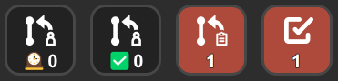

# Stream Deck - Gitlab

This plugin integrates Gitlab on your [Elgato Stream Deck](https://www.elgato.com/en/stream-deck).

## Features
- **Refresh rate** : 30 seconds
- **Actions** 
  - **Pending Todos count** : Displays the current count of your pending todos.
  - **Merge Request Review count** : Displays the current count of your active Merge Requests. This means an active MR you are the author.
  - **Unapproved Review Requests count** : Displays the current count of your active unapproved merge request reviews requested. This means an active MR requested from others (you're a reviewer but not the author).
  - **Actions states** :
    - **Red** : Count > 0
    - **Black** : Count = 0

## Download
You can download a copy from the [GitHub release pages](https://github.com/sponsCA/streamdeck-gitlab/releases/latest).

## Installation
You'll have to generate a [Personal Access Token](https://docs.gitlab.com/ee/user/profile/personal_access_tokens.html#create-a-personal-access-token) in your Gitlab instance account. Required scopes are:
- `read_api`

## Plugin Setup
- **Title:** Leave it empty, otherwise you won't be able to see the counter
- **Access token:** *(required)* Provide your 20 characters long *Personal Access Token*, which is required for the plugin to work
- **Server Url:** *(required)* Change from the *default* URL (https://gitlab.com/) to the API URL of your own/company instance
- **Username**: *(required for some actions)* Provide your username, which is required for the plugin to work

## FAQ / Troubleshooting
- Why am I getting a yellow triangle when pressing the button?
    - Your settings are likely incorrect
- Can I use another username instead of mine?
    - Yes, you can use any username you want as long as it's a valid one.
## TO-DOs
Feel free to contribute to this repository.
- Add compatibility with macOS
- Use GlobalSettings instead of Settings
- Add any other useful feature

## Credits
- Feel free to star this repository
- Thanks to weimeng for the [original images](https://github.com/weimeng/streamdeck-gitlab/tree/main/Sources/co.weimeng.streamdeck-gitlab.sdPlugin/img)
- Thanks to [Bar Raiders](https://barraider.com/) for the great tooling and community

## License

This project is licensed under the MIT License - see the [LICENSE](LICENSE) file for details
